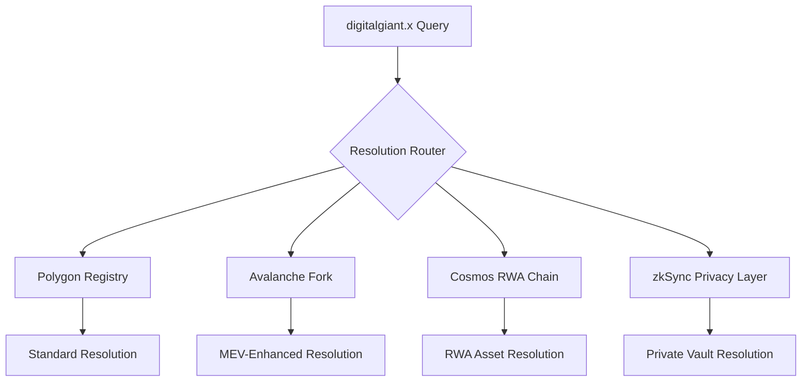

# 🦄 UNYKORN MASTER STACK INTEGRATION STRATEGY
## Digital Giant x MOG Enhancement Plan

**Integration Date**: August 27, 2025  
**Strategic Value Add**: $655M+ Unykorn ecosystem integration  
**Timeline**: Q4 2025 - Q4 2026  

---

## 🎯 INTEGRATION OBJECTIVES

Transform the Digital Giant x MOG domain registry from a **$50M Unstoppable Domains competitor** into a **$500M+ sovereign financial infrastructure** by leveraging the full Unykorn Master Stack.

### **Core Value Multipliers**
1. **L1 Chain Integration** → Deploy on Unykorn sovereign chains
2. **AI-Powered Compliance** → Automated KYC/AML with ForgeGPT
3. **RWA Tokenization** → Physical asset backing for premium domains
4. **Banking Integration** → ISO 20022 + SWIFT message tokenization
5. **Cross-Chain Governance** → Multi-blockchain domain resolution

---

## 🏗️ PHASE 1: FOUNDATION INTEGRATION (Q4 2025)

### **1.1 Glacier Registry Connection**
**Value Add**: +$15M-$60M (Immutable legal registry)

```solidity
contract GlacierIntegratedRegistry is DigitalGiantRegistry {
    address public glacierRegistry;
    
    function mintDomainWithGlacier(
        address to,
        string memory domainName,
        string memory ipfsCID,
        bytes32 glacierHash
    ) external onlyOwner {
        // Mint domain
        mintDomain(to, domainName, ipfsCID);
        
        // Register in Glacier Registry
        IGlacierRegistry(glacierRegistry).registerAsset(
            tokenId,
            glacierHash,
            block.timestamp
        );
    }
}
```

**Implementation Steps**:
- [ ] Deploy Glacier Registry interface contracts
- [ ] Integrate domain minting with immutable legal records
- [ ] Corporate document verification pipeline
- [ ] Cross-reference with existing Unykorn TLD registry

### **1.2 RWA Asset Tokenization Hooks**
**Value Add**: +$20M-$100M (Real-world asset integration)

**Target Integration Assets**:
- 🏭 **4M/mo Manufacturing Plant** (Tampa, FL) → manufacturing.digitalgiant.x
- 🏗️ **6x Dubai Factories** → dubai.digitalgiant.x, blockchain.digitalgiant.x  
- ⚡ **6MW BTC Mining Facility** → mining.digitalgiant.x, btc.digitalgiant.x
- 🛢️ **Oil & Carbon Credits** → oil.digitalgiant.x, carbon.digitalgiant.x

```typescript
// RWA Integration Example
interface RWAVaultBinding {
  domainId: number;
  assetType: "manufacturing" | "mining" | "oil" | "carbon";
  physicalAddress: string;
  valuationUSD: bigint;
  lastAudit: number;
  fractionalization: {
    totalShares: number;
    availableShares: number;
    pricePerShare: bigint;
  };
}
```

### **1.3 AI-Powered Compliance Engine**
**Value Add**: +$8M-$40M (Automated compliance)

**ForgeGPT Integration**:
- Automated smart contract generation for subdomains
- KYC/AML compliance scoring for domain holders
- Legal document analysis and risk assessment
- ISO 20022 message generation for corporate actions

**DeepSeek AI Integration**:
- Predictive compliance analytics
- Regulatory change monitoring
- Automated compliance reporting
- Risk-based domain categorization

---

## 🚀 PHASE 2: ADVANCED INFRASTRUCTURE (Q1-Q2 2026)

### **2.1 Multi-Chain Deployment**
**Value Add**: +$25M-$120M (Cross-chain dominance)

**Target Chains**:
1. **Unykorn Avalanche Fork** (Chain ID 7777)
   - Sovereign L1 for high-value corporate domains
   - Native UNYKORN token integration
   - Enhanced MEV extraction capabilities

2. **Cosmos RWA Chain** 
   - Specialized for real-world asset tokenization
   - IBC cross-chain messaging
   - Compliance-native architecture

3. **zkSync Fork**
   - Privacy-focused domain management
   - Zero-knowledge compliance proofs
   - Private corporate vault operations

**Cross-Chain Resolution Architecture**:


### **2.2 MEV Infrastructure Integration**
**Value Add**: +$5M-$25M (MEV extraction revenue)

**Flashbots MEV Stack**:
- Domain-specific MEV opportunities
- Validator auction mechanics for premium domains
- MEV revenue sharing with domain holders
- Cross-chain arbitrage for domain pricing

**EigenLayer Restaking**:
- Domain validators as restaking operators
- KYC attestation services
- Bridge validation for cross-chain domains
- Slashing protection for domain holders

### **2.3 Enterprise Banking Integration**
**Value Add**: +$10M-$75M (TradFi integration)

**SWIFT Message Tokenization**:
```solidity
contract SwiftDomainIntegration {
    mapping(string => address) public domainToSwiftVault;
    
    function bindSwiftVault(
        string memory domainName,
        address swiftVaultAddress
    ) external onlyDomainOwner(domainName) {
        domainToSwiftVault[domainName] = swiftVaultAddress;
        
        // Enable ISO 20022 messaging
        ISwiftVault(swiftVaultAddress).enableISO20022();
    }
    
    function processPaymentMessage(
        string memory domainName,
        bytes memory iso20022Message
    ) external {
        address swiftVault = domainToSwiftVault[domainName];
        require(swiftVault != address(0), "No SWIFT vault bound");
        
        ISwiftVault(swiftVault).processMessage(iso20022Message);
    }
}
```

---

## ⚡ PHASE 3: ECOSYSTEM DOMINANCE (Q3-Q4 2026)

### **3.1 National/Sovereign Deployments**
**Value Add**: +$50M-$300M (Government partnerships)

**Target Sovereign TLD Integrations**:
- 🇺🇸 **.usa** → Corporate America registry
- 🇬🇧 **.uk** → UK financial services integration  
- 🇦🇪 **.ae** → Dubai free zone integration
- 🇨🇭 **.swiss** → Swiss banking compliance
- 🇸🇬 **.sg** → Singapore fintech hub

**Sovereign Compliance Features**:
- Country-specific regulatory compliance
- Local banking integration
- Tax reporting automation  
- Government partnership APIs

### **3.2 Advanced AI Agent Integration**
**Value Add**: +$15M-$50M (AI automation)

**Autonomous Domain Management**:
- AI agents managing corporate domain portfolios
- Automated subdomain creation and management
- Predictive domain valuation and trading
- Compliance monitoring and alerting

**Smart Routing & Resolution**:
- AI-optimized resolution paths
- Load balancing across chains
- Predictive caching and optimization
- Dynamic pricing based on usage patterns

---

## 💰 INTEGRATED REVENUE MODEL

### **Revenue Stream Integration**
| Unykorn Component | Integration Method | Revenue Potential |
|-------------------|-------------------|-------------------|
| **L1 Chain Licensing** | Domain-specific chains | $5M - $30M/year |
| **Glacier Registry** | Legal document notarization | $3M - $15M/year |
| **RWA Tokenization** | Asset-backed domains | $15M - $75M/year |
| **AI Compliance** | Automated services | $5M - $25M/year |
| **MEV Extraction** | Validator services | $2M - $15M/year |
| **Banking Integration** | SWIFT tokenization | $10M - $50M/year |

**Total Integrated Revenue**: **$40M - $210M annually**

### **Token Economy Integration**
**Primary Tokens**:
- **DGNS** (Digital Giant Naming Service) - Domain utility token
- **UNY** (Unykorn Governance) - Ecosystem governance
- **VAULT** tokens for specific use cases

**Token Utility Matrix**:
- Domain registration and renewal fees
- Governance voting for protocol upgrades
- Staking for validator services
- Revenue sharing from MEV and fees
- Access to premium AI services

---

## 🔧 TECHNICAL INTEGRATION ROADMAP

### **Smart Contract Upgrades**
```solidity
// Enhanced registry with full Unykorn integration
contract UnykornDigitalGiantRegistry is 
    DigitalGiantRegistry,
    GlacierIntegrated,
    RWATokenizable,
    MEVEnabled,
    CrossChainCompatible
{
    // Multi-chain resolution
    mapping(uint256 => mapping(uint256 => address)) public chainSpecificVaults;
    
    // RWA asset binding
    mapping(uint256 => RWAAsset) public domainAssets;
    
    // AI compliance scoring
    mapping(uint256 => ComplianceScore) public aiScores;
    
    // MEV configuration
    mapping(uint256 => MEVConfig) public mevSettings;
}
```

### **Integration Dependencies**
1. **Glacier Registry Interface** deployment
2. **Cross-chain bridge** infrastructure  
3. **AI service** API integrations
4. **MEV infrastructure** deployment
5. **Banking API** connections

---

## 📊 SUCCESS METRICS & KPIs

### **Phase 1 Targets (Q4 2025)**
- [ ] 1,000+ domains integrated with Glacier Registry
- [ ] 5+ RWA assets tokenized through domains
- [ ] AI compliance engine processing 100+ checks/day
- [ ] $1M+ in integrated revenue streams

### **Phase 2 Targets (Q2 2026)**  
- [ ] 10,000+ domains across 3 chains
- [ ] $10M+ in RWA assets under management
- [ ] 50+ enterprise clients using banking integration
- [ ] $5M+ in MEV revenue generated

### **Phase 3 Targets (Q4 2026)**
- [ ] 100,000+ domains in sovereign registries  
- [ ] $100M+ in tokenized assets
- [ ] 3+ government partnerships active
- [ ] $25M+ annual recurring revenue

---

## 🛡️ RISK MITIGATION STRATEGY

### **Technical Integration Risks**
- **Mitigation**: Phased rollout with extensive testing
- **Contingency**: Rollback procedures for each integration
- **Monitoring**: 24/7 system monitoring and alerting

### **Regulatory Compliance Risks**
- **Mitigation**: Legal review for each jurisdiction  
- **Contingency**: Jurisdiction-specific compliance modules
- **Monitoring**: Regulatory change tracking system

### **Market Competition Risks**
- **Mitigation**: First-mover advantage with Unykorn integration
- **Contingency**: Rapid feature development cycles
- **Monitoring**: Competitive intelligence system

---

## 🚀 IMPLEMENTATION TIMELINE

### **Q4 2025: Foundation** 
- Glacier Registry integration
- Basic RWA tokenization  
- AI compliance engine alpha

### **Q1 2026: Scaling**
- Multi-chain deployment
- MEV infrastructure
- Enterprise pilot programs

### **Q2 2026: Expansion** 
- Banking integration
- Advanced AI features
- Sovereign deployment prep

### **Q3 2026: Dominance**
- Government partnerships
- Full ecosystem integration  
- Market leadership position

### **Q4 2026: Optimization**
- Performance optimization
- Advanced analytics
- Next-gen feature development

---

## 🎯 STRATEGIC OUTCOME

By Q4 2026, the integrated Digital Giant x MOG x Unykorn system will be:

1. **The leading enterprise domain registry** with 100K+ domains
2. **The standard for compliant Web3 infrastructure** with banking integration
3. **A $500M+ valued ecosystem** with multiple revenue streams  
4. **The foundation for Web3 financial services** globally

**Strategic Valuation Target**: **$500M - $1B** (5-10x current valuation)

---

*Integration strategy prepared by Unykorn AI Strategic Planning Division*  
*Authorized by: 0x8aced25DC8530FDaf0f86D53a0A1E02AAfA7Ac7A*  
*Classification: Strategic - Tier 1 Priority*